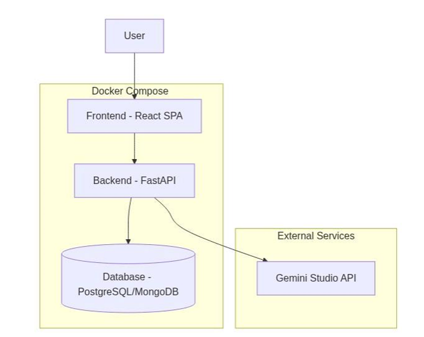
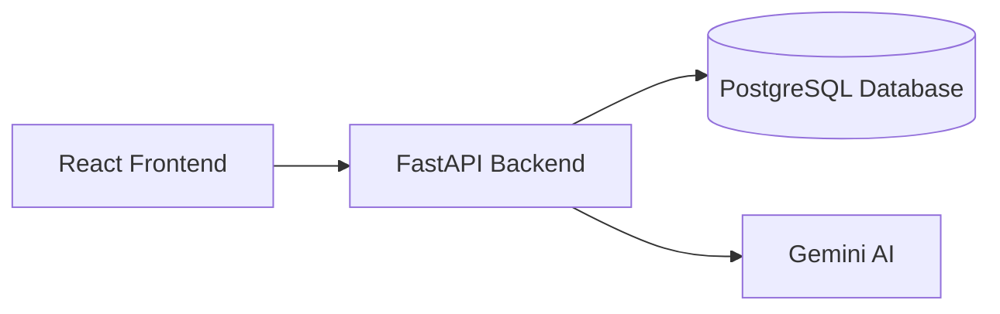

# InterviewPrep Platform


## Project Summary

**InterviewPrep** is an AI-powered full-stack platform designed to help users prepare for job interviews. Users select a job title (e.g., “Data Scientist”) and receive a set of technical and behavioral questions generated by Gemini Studio. The platform lets users save, organize, and rate questions'difficulties, as well as flag interesting ones for future review.

---
## System Architecture


## Getting Started

### Prerequisites

- Docker & Docker Compose
- Python 3.13 (for local development)
- Node.js (for frontend, if building locally)
- PostgreSQL (for database)
- FastAPI (for backend)
- Gemini API Key (for question generation)

### Setup Steps

1. **Clone the repository**
   ```bash
   git clone <your-repo-url>
   cd MyInterviewPrep
   ```

2. **Configure Environment Variables**
   - Edit `docker-compose.yml` and set your `GEMINI_API_KEY` under `backend.environment`.

3. **Start the Platform**
   ```bash
   docker-compose up --build
   ```
   - This will start:
     - **Frontend** on `localhost:3000`
     - **Backend (FastAPI)** on `localhost:8000`
     - **PostgreSQL** on port `5433`

---

## API Routes & Usage

| Route                              | Method | Description                                 |
|-------------------------------------|--------|---------------------------------------------|
| `/api/questions/generate`           | POST   | Generate interview questions via Gemini     |
| `/api/questions`                    | GET    | List questions with filters                 |
| `/api/questions`                    | POST   | Save/modify a question (difficulty/flag)    |
| `/api/questions/{question_id}`      | DELETE | Delete a question                           |
| `/api/stats`                        | GET    | Get stats (counts by difficulty/job/flagged)|

### Example Usage

#### Generate Questions
```http
POST /api/questions/generate
Content-Type: application/json

{
  "job_title": "Data Scientist",
  "num_technical": 3, # Optional where default is 1
  "num_behavioral": 2 # Optional where default is 1
}
```
### Successful Response
```json

{
  "questions": [
    {
      "id": "3fa85f64-5717-4562-b3fc-2c963f66afa6",
      "job_title": "Data Scientist",
      "question_type": "technical",
      "question": "Explain the difference between supervised and unsupervised learning...",
      "difficulty": "medium",
      "flagged": false,
      "created_at": "2023-07-20T12:34:56Z"
    }
  ]
}
```

#### Get Questions
```http
GET /api/questions?job_title=data scientist&difficulty=easy
```

#### Save/Modify Question
```http
POST /api/questions?question_id=<uuid>&difficulty=hard&is_interesting=true
```

#### Delete Question
```http
DELETE /api/questions/<uuid>
```

#### Get Stats
```http
GET /api/stats
```

---

## Frontend + Backend Overview

- **Frontend**: React app (in `/Frontend`) connects to FastAPI backend via REST API.
- **Backend**: FastAPI app (in `/Backend`) handles API requests, integrates with Gemini Studio, and persists data in PostgreSQL.
- **Database**: PostgreSQL stores all questions, flags, difficulty ratings, and metadata.

---

## Data Schema

**Question Table (`questions`)**

| Field         | Type      | Description                      |
|---------------|-----------|----------------------------------|
| id            | UUID      | Unique identifier                |
| job_title     | String    | Job title (e.g., "Data Scientist")|
| question_type | Enum      | "technical" or "behavioral"      |
| question      | String    | The question text                |
| difficulty    | String    | "easy", "medium", "hard"         |
| flagged       | Boolean   | User-flagged as interesting      |
| created_at    | DateTime  | Timestamp                        |

---

## Gemini Studio Integration

- The backend uses Gemini Studio API to generate interview questions.
- Endpoint: `/api/questions/generate`
- Requires a valid `GEMINI_API_KEY`.
- Returns a list of technical and behavioral questions based on user input.

---

## Limitations & Known Issues

- **Table Creation**: Tables must be created before running the backend. Run `python database.py` manually if not using Docker.
- **Gemini API**: Requires a valid API key. If the key is missing or invalid, question generation will fail.
- **Error Handling**: Some error messages may be generic; more detailed logging is recommended for production.
- **Database Migrations**: No Alembic integration; schema changes require manual table recreation.
- **Concurrency**: In-memory lists (`QUESTIONS_DB_GENERATED`) are not thread-safe and should not be used in production.
- **Docker Compose**: Initial Docker build takes 8-12 minutes, requires minimum 2GB RAM. Make sure ports do not conflict with other local services.
- **Frontend**: You might face some problems with React so, make you that you inspect my Backend using 'localhost:8000\docs'

---

## Contact

**Alaa MORSY**  
Email: [alaa.morsy@valeo.com](mailto:alaa.morsy@valeo.com)

For questions or issues, please open an issue on GitHub or contact me directly.
